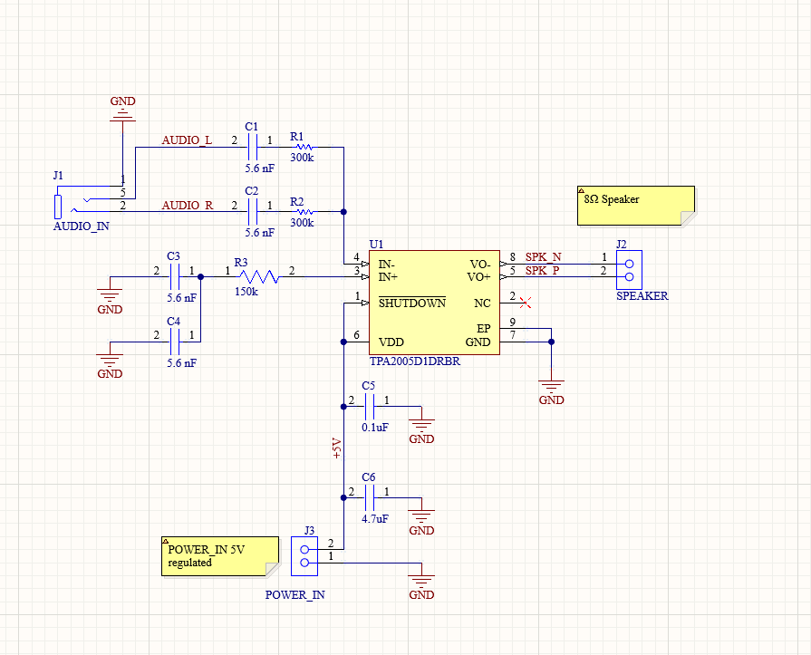
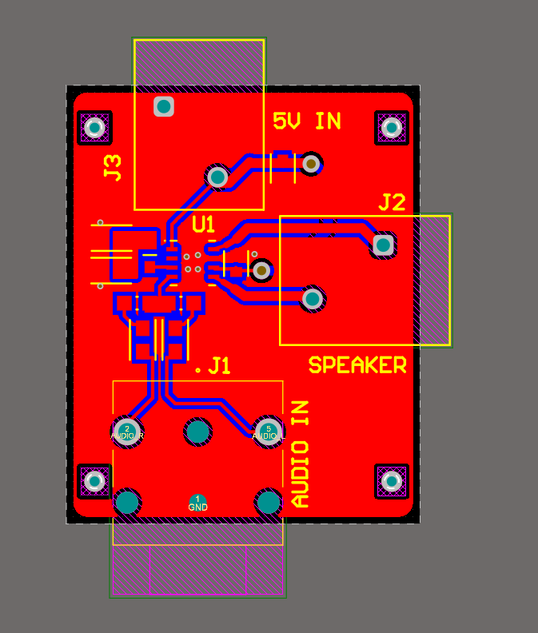
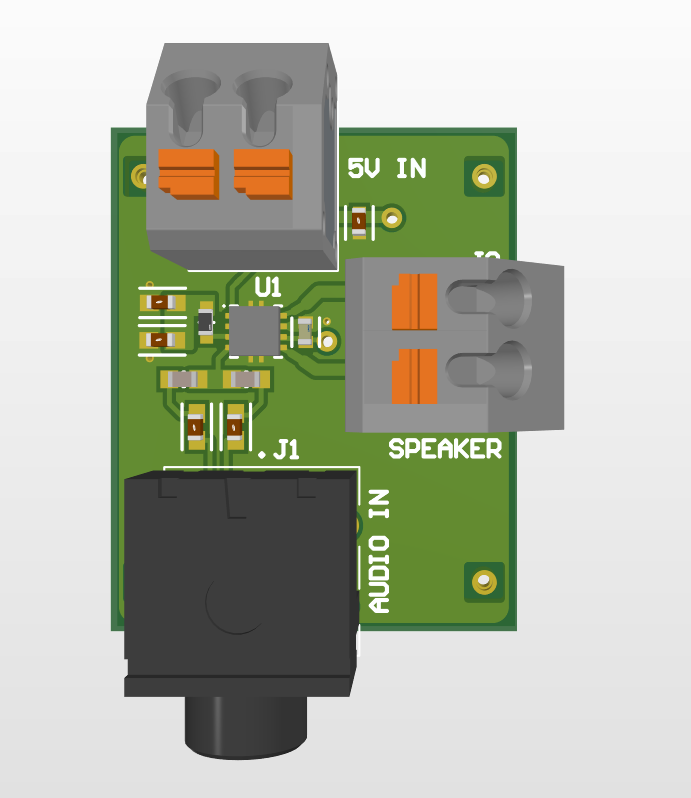

# Class-D Audio Amplifier PCB

A two-layer Class-D audio amplifier PCB designed in Altium Designer
to drive an 8 Ω, 1 W speaker from an external audio source.

## Overview

This project was created to develop experience with analog circuit design,
component selection, schematic capture, and two-layer PCB layout.

The board accepts an audio input through a 3.5 mm jack and uses a Class-D
amplifier (TPA2005D1DRBR) to drive an external speaker. Screw terminals provide power and
speaker connections.

## Design Requirements

| Parameter | Value |
|---|---:|
| Speaker impedance | 8 Ω |
| Speaker power rating | 1 W |
| PCB layers | 2 |
| Audio input | 3.5 mm audio jack |
| PCB design software | Altium Designer |

## Schematic
- AC-coupling and input high-pass filtering
- Gain-setting components
- Local supply decoupling
- Class-D speaker output
- Screw-terminal power and speaker connections

## PCB Layout

Layout considerations included:

- Placing the supply-decoupling capacitor close to the amplifier IC
- Keeping speaker-output paths short
- Providing a continuous ground return
  
### 2D Layout

### 3D Render

## Design Calculations

Gain 1&2 calculated with:
2* 150kΩ/Ri.
For a total gain of approximately 2, Ri selected for each input = 300k.

The input high-pass filter cutoff was calculated using:
fc = 1 / (2πRC)
For a cut off frequency of about 100hz, a 5.6nF capacitor was chosen.

Power capacitors were chosen according to datasheet recommendations.
